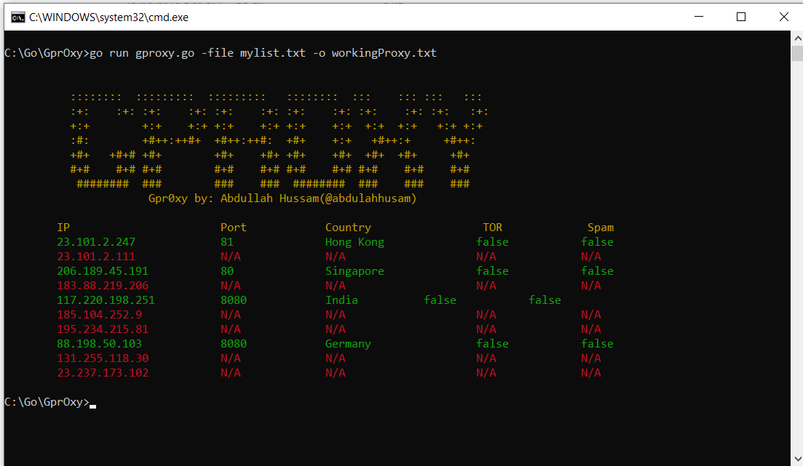

# GprOxy.go 

GprOxy is a tool to check active web proxies and save the working ones to use later in further attacks such as IP rate-limit, blocking, and country connection check.




## Installation

OS X & Linux:

```
root@host:$ git clone https://github.com/ahussam/GprOxy.git
root@host:$ cd GprOxy 
root@host:$ go get github.com/fatih/color
root@host:$ go run gproxy -file mylist.txt -o out.txt
```


Windows:

```
C:\> git clone https://github.com/ahussam/GprOxy.git
C:\> cd GprOxy 
C:\> go get github.com/fatih/color
C:\> go run gproxy -file mylist.txt -o out.txt
```


## Usage example
```
Usage:
  gproxy.go

Flags:
  -file,       Proxies list filename e.g: mylist.txt
  -active,     Show active proxy only during the process(default:false) 
  -o,          output filename(default:output.txt) 
 
```

*Note*: proxies file must be in the following format: 

```
127.0.0.1:8080
122.13.167.122:2020
172.24.144.76:3321
...
...
...
```
## Version 
* 0.1
    * First Release.

## Authors

* **Abdullah Hussam** - [ahussam](https://github.com/ahussam)

## Contributing

1. Fork it (<https://github.com/ahussam/GprOxy/fork>)
2. Create your feature branch (`git checkout -b feature/fooBar`)
3. Commit your changes (`git commit -am 'Add some fooBar'`)
4. Push to the branch (`git push origin feature/fooBar`)
5. Create a new Pull Request
